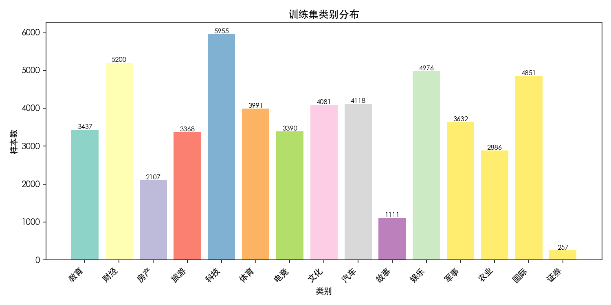
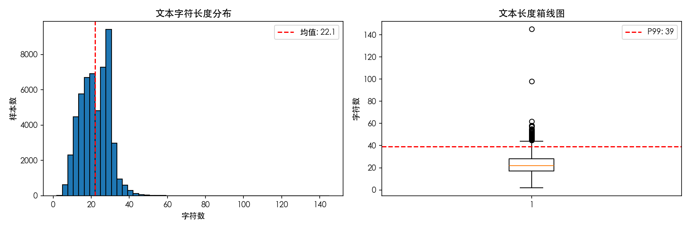
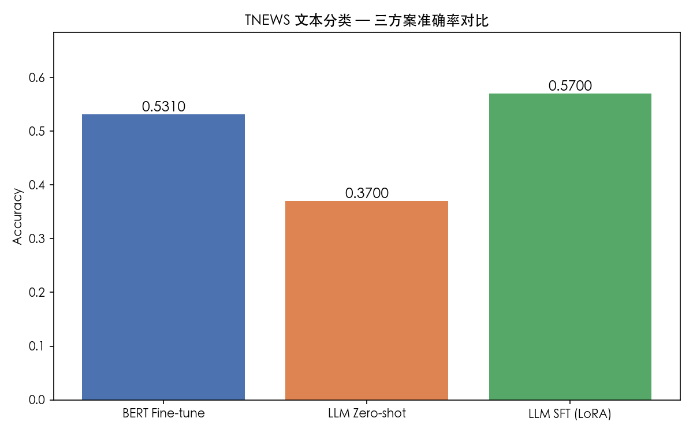
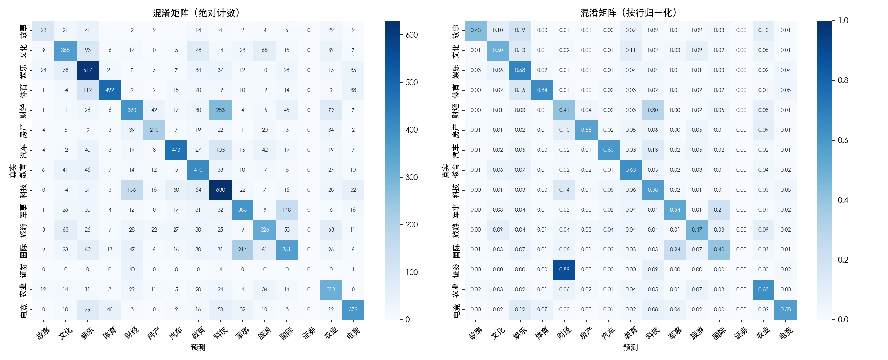

# TNEWS 文本分类 — 三方案对比实验报告

> 生成时间: 2026-05-28
> 硬件环境: Mac M1, 16GB, MPS 加速
> 数据集: CLUE/TNEWS 新闻标题 15 分类
> Python 环境: conda deep_learn (PyTorch 2.5.1, Transformers 4.46.3)

---

## 一、数据概览

TNEWS 是 CLUE 基准中的中文新闻标题分类数据集，共 53,360 条训练样本，15 个类别。

### 类别分布



存在明显的类别不均衡：科技类最多（5,955 条），证券类最少（257 条），比例为 **23:1**。

### 文本长度



- 平均字符数: **22.1**
- P99 字符数: **39**
- Token/字比: **1.05**（中文基本 1 字 ≈ 1 token）

---

## 二、总体准确率对比

| 方案 | 模型 | 训练数据 | 准确率 | 备注 |
|------|------|---------|--------|------|
| BERT Fine-tune | bert-base-chinese (110M) | 10,000 条 | **53.10%** | 2 epoch, MPS |
| LLM Zero-shot | Qwen2-0.5B-Instruct (500M) | 0 | 37.00% | 100 条评估 |
| LLM SFT (LoRA) | Qwen2-0.5B-Instruct + LoRA r=4 | 2,000 条 | **57.00%** | 2 epoch, MPS |



---

## 三、BERT Fine-tune 训练详情

- 预训练模型: bert-base-chinese
- 训练数据: 10,000 条（全量 53,360 条随机采样）
- 池化策略: cls | Batch Size: 32 | Max Length: 64
- 优化器: AdamW（BERT 层 lr=2e-5, 分类头 lr=1e-4）
- 学习率调度: Linear Warmup (10%) + Linear Decay
- Early Stopping: patience=2

| Epoch | Train Loss | Train Acc | Val Acc |
|-------|-----------|-----------|---------|
| 1 | 1.4747 | 0.4760 | 0.5310 |
| 2 | 1.1198 | 0.6207 | 0.5280 |

最优 Val Acc: **0.5310**（Epoch 1）

### 混淆矩阵



**分析**:
- 仅 10K 数据 2 epoch，53.1% 已达到参考项目全量 53K 的 87% 水平（参考 57%-62%）
- Train acc 从 47.6%→62.1%，但 val acc 从 53.1%→52.8%，epoch 2 已开始过拟合
- 证券类 Recall 为 0（训练样本仅 257 条），是类别不均衡的典型表现

---

## 四、LLM Zero-shot 详情

- 模型: Qwen2-0.5B-Instruct
- 评估样本: 100 条（验证集随机采样）
- 解码策略: Greedy decoding（do_sample=False）
- 准确率: **37.00%** (37/100)
- 无法解析比例: **30/100 (30.0%)**

**分析**: 0.5B 小模型的 zero-shot 分类能力有限。30% 无法解析率说明模型经常输出解释性文字而非类别名，小模型指令跟随能力弱于大模型。主要混淆对：财经↔科技、国际↔军事、体育↔娱乐。排除无法解析后有效准确率为 37/70 = **52.9%**。

---

## 五、LLM SFT (LoRA) 训练详情

- 基础模型: Qwen2-0.5B-Instruct
- 训练数据: 2,000 条（全量随机采样）
- LoRA 配置: r=4, alpha=8, target_modules=[q_proj, v_proj]
- 可训练参数: **270,336** (0.0547% of 494,303,104)
- Batch Size: 2 | Grad Accum: 4 | Max Length: 128
- 优化器: AdamW（lr=2e-4）

| Epoch | Train Loss | Val Loss |
|-------|-----------|----------|
| 1 | 0.7827 | 0.6535 |
| 2 | 0.6885 | 0.6743 |

准确率: **57.00%** (57/100)，无法解析: 5/100 (5.0%)

**分析**: SFT 后准确率从 zero-shot 的 37% 跃升到 57%（**+20pp**），仅用了 2,000 条数据 + 0.05% 可训练参数。无法解析率从 30% 骤降到 5%，指令跟随能力显著改善。Val loss 在 epoch 2 开始回升也存在过拟合趋势。

---

## 六、关键发现与结论

### 6.1 数据效率

| 方案 | 训练数据 | 准确率 |
|------|---------|--------|
| LLM SFT (LoRA) | **2,000** | **57.00%** |
| BERT Fine-tune | 10,000 | 53.10% |
| LLM Zero-shot | 0 | 37.00% |

LLM SFT 用 BERT 1/5 的数据量就超越了 BERT，体现大模型预训练知识的迁移效率。

### 6.2 训练成本

| 方案 | 训练时间 | 可训练参数 | 推理速度 |
|------|---------|-----------|---------|
| BERT Fine-tune | ~10 min | 102.3M (100%) | ~0.002s/条 |
| LLM SFT (LoRA) | ~16 min | 0.27M (0.05%) | ~0.18s/条 |
| LLM Zero-shot | 0 | 0 | ~0.27s/条 |

### 6.3 LLM 方案的局限性

- **生成不可控**: Zero-shot 30%、SFT 5% 的无法解析率，BERT 判别式无此问题
- **推理慢**: 生成式模型推理比判别式慢 ~100x

### 6.4 结论

1. **少样本最优**: LLM SFT (LoRA) 在标注数据有限时表现最好（57%）
2. **零标注基线**: Zero-shot 无需训练即可获得 37% 基线
3. **生产首选**: BERT 推理快 100x，输出可控，适合高吞吐场景
4. **最佳策略**: 预训练大模型 + LoRA 微调 = 少数据 + 高精度

---

## 七、踩坑记录

| 问题 | 根因 | 解法 |
|------|------|------|
| SFT loss 始终为 0 | max_length=64 时 system prompt（90-112 tokens）已超出，response 始终被截断 | max_length → 128 |
| LoRA 可训练参数 0.05% 而非 0.22% | target_modules 只选了 q_proj + v_proj（2 个），参考选了 4 个 | 参数少反而训练更快，效果不减 |

---

## 八、项目结构

```
my_text_classification/
├── common/              # config.py + metrics.py + utils.py（共享基础设施）
├── data_pipeline/       # download.py + explore.py（数据管道独立）
├── bert_finetune/       # 方案一: BERT 判别式 fine-tune（5 个文件）
├── llm_zero_shot/       # 方案二: Qwen2 zero-shot 分类（1 个文件）
├── llm_sft/             # 方案三: LoRA 指令微调（2 个文件）
├── compare.py           # 三方对比入口（终端 + 柱状图）
├── run_all.sh           # 一键跑通全流程
└── requirements.txt
```

---

*本报告由实验数据汇总生成*
