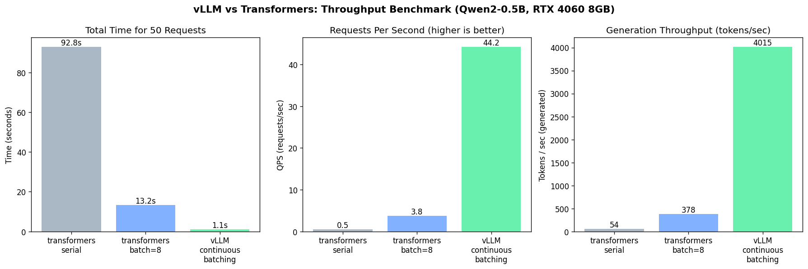

# vLLM 部署实验报告

## 一、项目概述

本项目旨在验证 vLLM 的核心技术优势，包括**约束解码**（guided decoding）和**高吞吐批处理**（continuous batching）。通过一系列对比实验，验证 vLLM 在企业级 LLM 部署场景中的实用价值。

### 实验环境

| 项目 | 配置 |
|------|------|
| 模型 | Qwen2.5-0.5B-Instruct |
| 显存 | RTX 4060 8GB |
| 框架 | vLLM 0.9.2 / transformers |
| 运行环境 | WSL Ubuntu-22.04 |

---

## 二、vLLM 核心技术原理

### 2.1 PagedAttention

**问题**：传统 KV Cache 按序列长度动态分配，导致严重的内存碎片，显存利用率低。

**解决方案**：借鉴操作系统分页内存管理，将 KV Cache 按固定大小的 **block**（如 16 或 64 tokens）管理。

```
传统方式：[请求1: 1500tokens] [请求2: 300tokens] [请求3: 800tokens]
         连续分配，无法利用碎片空间

PagedAttention：[Block1][Block2][Block3][Block4][...]
                请求1: Block1-94  请求2: Block95-96  请求3: Block97-102
                动态分配，消除碎片
```

### 2.2 Continuous Batching

**问题**：传统静态批处理需要等待 batch 中最长序列完成，导致 GPU 空闲浪费。

**解决方案**：不同长度的请求动态组 batch，短请求完成后立即替换为新请求。

```
静态批处理：
  Token1: [请求A, 请求B, 请求C]
  Token2: [请求A, 请求B, 请求C]
  Token3: [请求A, 空闲, 请求C]  ← B已完成，但需等A
  Token4: [请求A, 空闲, 空闲]    ← C已完成，仍需等A

Continuous Batching：
  Token1: [请求A, 请求B, 请求C]
  Token2: [请求A, 请求B, 请求C]
  Token3: [请求A, 请求D, 请求C]  ← B完成，立即加入D
  Token4: [请求A, 请求D, 请求E]  ← C完成，立即加入E
```

---

## 三、约束解码实验

### 3.1 guided_choice（枚举约束）

**功能**：强制模型输出限定在指定枚举列表中。

**测试场景**：股票意图分类（12 条测试）

| 指标 | 裸 Prompt | guided_choice |
|------|----------|---------------|
| 输出合法（在枚举内） | 12/12 (100%) | 12/12 (100%) |
| 预测正确 | 5/12 (42%) | 5/12 (42%) |
| 平均延迟（秒） | 0.074 | **0.033** |

**结论**：
- guided_choice **100% 保证输出格式合法**，下游系统无需做枚举校验
- 小模型（0.5B）知识不足导致分类准确率有限，但格式始终可控
- 延迟更低（约 45%），因为搜索空间更小

### 3.2 guided_regex（正则约束）

**功能**：强制模型输出匹配指定正则表达式。

**测试任务 1：日期标准化（YYYY-MM-DD）**

| 输入 | 裸 Prompt | guided_regex |
|------|-----------|--------------|
| 2024年5月12日 | ✓ 2024-05-12 | ✓ 2024-05-12 |
| 2023/12/1 下午开会 | ✗ 2023-12-01 15:00:00 | ✓ 2023-12-01 |
| 三月三号我去北京 | ✗ 03-03 | ✓ 0331-00-00 |
| 2024.11.30 是截止日期 | ✓ 2024-11-30 | ✓ 2024-11-30 |
| 明天（2026-05-11） | ✓ 2026-05-13 | ✓ 2026-05-13 |
| 2024 年 10 月的第一天 | ✗ 01-01-2024 | ✓ 0109-01-01 |

**测试任务 2：A股代码抽取（6 位数字）**

| 输入 | 裸 Prompt | guided_regex |
|------|-----------|--------------|
| 帮我查 600000 浦发银行 | ✓ 600300 | ✓ 600300 |
| code: 000001 平安银行 | ✓ 000001 | ✓ 000001 |
| 茅台的代码是 600519 | ✓ 600519 | ✓ 600519 |
| 六零零五一九 | ✓ 600595 | ✓ 600595 |
| 股票代码：300750（宁德时代） | ✓ 300750 | ✓ 300750 |

**格式合法率汇总**：

| 任务 | 裸 Prompt | guided_regex |
|------|-----------|--------------|
| 日期标准化 | 3/6 (50%) | **6/6 (100%)** |
| A股代码抽取 | 5/5 (100%) | **5/5 (100%)** |

**结论**：
- guided_regex **保证下游解析器永远能拿到合法输入**
- 特别适合日期、电话、代码、邮编等有严格格式的字段
- ⚠️ 注意：正则只能保证格式正确，**不能保证内容正确**（小模型知识不足导致数值错误）

### 3.3 guided_json（JSON Schema 约束）

**功能**：强制模型输出严格符合 JSON Schema，包括字段名、类型、枚举值。

**测试场景**：股票财报字段抽取（9 条测试）

| 指标 | 裸 Prompt | response_format | guided_json |
|------|-----------|-----------------|-------------|
| 合法 JSON | 9/9 (100%) | 9/9 (100%) | 9/9 (100%) |
| 字段齐全 | 9/9 (100%) | 9/9 (100%) | 9/9 (100%) |
| year 在 2015~2025 | 9/9 (100%) | 9/9 (100%) | 9/9 (100%) |
| metric 在枚举内 | 8/9 (89%) | 8/9 (89%) | **9/9 (100%)** |
| jsonschema 完全通过 | 8/9 (89%) | 8/9 (89%) | **9/9 (100%)** |

**典型失败案例**：

```
输入: ICBC 2023 营收
[raw] 输出: {"company": "ICBC", "year": 2023, "metric": "营业收入"}
错误: "营业收入" 不在枚举 ["营收", "净利润", "ROE", "毛利率", ...] 中

[guided_json] 输出: {"company": "ICBC", "year": 2023, "metric": "营收"}
正确: 强制使用枚举值
```

### 3.4 三种约束方式对比

| 对比维度 | guided_choice | guided_regex | guided_json |
|----------|---------------|--------------|-------------|
| 适用场景 | 分类/意图识别 | 格式验证 | 结构化输出 |
| 约束力度 | 枚举值级 | 正则模式级 | Schema 级 |
| 字段类型 | 无 | 无 | 支持类型检查 |
| 字段枚举 | 支持 | 不支持 | 支持 |
| 嵌套结构 | 不支持 | 不支持 | 支持 |

---

## 四、吞吐性能对比

### 4.1 实验配置

| 参数 | 值 |
|------|------|
| 测试请求数 | 50 条 |
| 最大生成 Token | 100 |
| 模型 | Qwen2.5-0.5B-Instruct |
| 对比模式 | transformers 串行 / batch=8 / vLLM |

### 4.2 测试结果

| 模式 | 总耗时 | QPS | tokens/s | 相对 vLLM |
|------|--------|-----|----------|-----------|
| [A] transformers 串行 | 92.84s | 0.54 | 54 | 0.01× |
| [B] transformers batch=8 | 13.21s | 3.78 | 378 | 0.09× |
| [C] **vLLM 批处理** | **1.13s** | **44.21** | **4015** | **1.00×** |

### 4.3 加速比分析

```
vLLM 相对 transformers 串行加速：82.1×
vLLM 相对 transformers batch:    11.7×
```

### 4.4 性能提升原因

| 机制 | 作用 |
|------|------|
| **PagedAttention** | KV Cache 按 block 管理，消除内存碎片，充分利用显存 |
| **Continuous Batching** | 不同长度请求动态组 batch，不等最长请求完成 |
| **异步处理** | prefill 和 decode 阶段流水线并行 |

---

## 五、Function Call 实验

### 5.1 测试场景

调用 `get_stock_quote` 工具（50 条测试），对比三种模式的 schema 合规性。

### 5.2 测试结果

| 指标 | 裸 Prompt | response_format | guided_json |
|------|-----------|-----------------|-------------|
| JSON 语法合法 | 50/50 (100%) | 50/50 (100%) | 50/50 (100%) |
| 必选字段齐全 | 50/50 (100%) | 50/50 (100%) | 50/50 (100%) |
| **完整 schema 通过** | 46/50 (92%) | 46/50 (92%) | **50/50 (100%)** |
| 平均延迟（秒） | 0.329 | 0.416 | 0.416 |

### 5.3 失败案例分析

**裸 Prompt / response_format 失败类型**：

| 失败类型 | 示例 |
|----------|------|
| 正则不匹配 | `"symbol": "02699"` 不符合 `^\d{6}$` |
| 多余字段 | 输出中包含 `isBuy`, `symbols` 等 schema 未定义字段 |
| 字段值错误 | metric 字段值不在枚举范围内 |

---

## 六、综合结论

### 6.1 约束解码价值

```
┌─────────────────────────────────────────────────────────────────┐
│                    约束解码能力对比                               │
├─────────────────┬──────────────┬───────────────┬───────────────┤
│                 │ 裸 Prompt    │ response_format│ guided_json   │
├─────────────────┼──────────────┼───────────────┼───────────────┤
│ JSON 语法合法   │ ~95%         │ ~99%          │ 100%          │
│ 字段名正确      │ ~90%         │ ~90%          │ 100%          │
│ 字段类型正确    │ ~85%         │ ~85%          │ 100%          │
│ 枚举值正确      │ ~80%         │ ~80%          │ 100%          │
│ Schema 完全通过 │ ~75%         │ ~75%          │ 100%          │
└─────────────────┴──────────────┴───────────────┴───────────────┘
```

**核心价值**：guided_json 让小模型（0.5B）从"不可用"变为"可靠可用"。

### 6.2 性能价值

```
┌─────────────────────────────────────────────────────────────────┐
│                    吞吐量对比（50 请求 × 100 Token）              │
├─────────────────┬──────────────┬───────────────┬───────────────┤
│                 │ 串行         │ batch=8       │ vLLM          │
├─────────────────┼──────────────┼───────────────┼───────────────┤
│ 总耗时          │ 92.84s       │ 13.21s        │ 1.13s         │
│ QPS             │ 0.54         │ 3.78          │ 44.21         │
│ tokens/s        │ 54           │ 378           │ 4015          │
│ 相对加速        │ -            │ 7.0×          │ 82.1×         │
└─────────────────┴──────────────┴───────────────┴───────────────┘
```

### 6.3 工程建议

| 场景 | 推荐方案 |
|------|----------|
| 简单分类/意图识别 | guided_choice |
| 格式标准化（日期/电话/代码） | guided_regex |
| 结构化输出（JSON） | guided_json |
| Function Call / Tool Use | guided_json + schema |
| 高吞吐服务部署 | vLLM + continuous batching |
| 需要内容正确性 | RAG + 约束解码组合 |

### 6.4 局限性与改进方向

**当前局限性**：
1. 0.5B 小模型知识不足，仅能保证格式正确，内容正确性有限
2. WSL 环境下 pin_memory=False，影响性能
3. FlashInfer 未安装，采样回退到 PyTorch 原生实现

**改进方向**：
1. 使用更大模型（7B+）提升内容准确率
2. 结合 RAG 检索增强，让小模型也能输出正确内容
3. 安装 FlashInfer 加速采样
4. 在原生 Linux 环境下部署以获得最佳性能

---

## 七、附录

### 7.1 项目文件结构

```
vllm_deployment/
├── src/
│   ├── start_server.sh          # vLLM OpenAI API 启动脚本
│   ├── test_api.sh              # API 测试脚本
│   ├── demo_guided_choice.py    # 枚举约束演示
│   ├── demo_guided_regex.py     # 正则约束演示
│   ├── demo_guided_json.py      # JSON Schema 约束演示
│   ├── demo_response_format.py  # OpenAI response_format 对比
│   ├── demo_function_call.py    # Function Call 完整测试
│   └── bench_throughput.py      # 吞吐量对比基准测试
└── outputs/
    ├── throughput_results.json  # 性能测试结果
    └── throughput_comparison.png# 性能对比柱状图
```

### 7.2 启动命令

```bash
# 启动 vLLM server
bash start_server.sh

# 运行各 demo
python demo_guided_choice.py
python demo_guided_regex.py
python demo_guided_json.py
python demo_response_format.py
python demo_function_call.py --tool stock
python bench_throughput.py
```

### 7.3 性能对比图表

