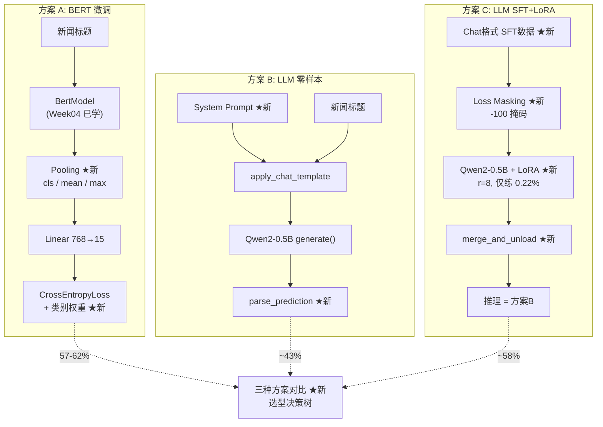

# 文本分类三种方案 — Week06 教学文案

## 前置要求

| 已知（Week03-05 学过） | 本周新学 |
|------------------------|----------|
| Python / NumPy / PyTorch 基础 | 分层学习率、类别权重处理不均衡 |
| Tokenization、BERT 架构 | LLM Prompt 设计 + 输出解析 |
| Dataset/DataLoader、训练循环 | SFT Chat 格式 + Loss 掩码 |
| CrossEntropyLoss、过拟合 | LoRA 原理 + 秩 r 对比 |

## 目录

- [零、前置回顾：你已经知道的](#零前置回顾你已经知道的)
- [一、这个项目做什么：三方案总览](#一这个项目做什么三方案总览)
- [二、数据：TNEWS 的三大工程决策](#二数据tnews-的三大工程决策)
- [三、BERT 方案的新技巧：分层LR + 池化 + 加权loss](#三bert-方案的新技巧分层lr--池化--加权loss)
- [四、LLM 零样本：不训练，直接问](#四llm-零样本不训练直接问)
- [五、LLM SFT+LoRA：用 0.22% 的参数追平 BERT](#五llm-sftlora用-022-的参数追平-bert)
- [六、横向对比：什么时候用什么](#六横向对比什么时候用什么)
- [全流程实操手册](#全流程实操手册)
- [附录 A：概念速查表](#附录-a概念速查表)
- [附录 B：常见问题 Q&A](#附录-b常见问题-qa)

---

## 零、前置回顾：你已经知道的

> 这一页帮你快速唤起 Week04 BERT 和 Week05 MyGPT 的记忆。如果下面的概念你想不起来，花 5 分钟回翻对应教案。

| 概念 | 一句话 | 来源 |
|------|--------|------|
| Tokenization | 把"国足晋级"变成 `[101, 1744, 4415, ...]` | 📎 Week04 第 2 节 |
| BERT = 12层 Transformer Encoder | 每层：Self-Attention + FFN，双向看上下文 | 📎 Week04 第 3 节 |
| `[CLS]` token | BERT 在句子开头插入的特殊 token，学过 NSP 任务 | 📎 Week04 第 4 节 |
| Dataset / DataLoader | `__getitem__` 返回 tokenized 数据，DataLoader 组 batch | 📎 Week05 第 2 节 |
| 训练循环 = forward → loss → backward → step | 本周继续用，但加了两个新技巧 | 📎 Week05 第 5 节 |
| 过拟合 | train_loss ↓ 但 val_acc ↓：模型在背答案 | 📎 Week05 第 7 节 |
| CrossEntropyLoss | `-log(softmax(logits)[true_class])` | 📎 Week05 第 5 节 |

> 如果你对上面的概念都熟悉，往下读。本周的重点不是重复这些——而是学**在它们之上构建的新工程技巧**。

---

## 一、这个项目做什么：三方案总览

### 一句话定义

用三种不同的方法把新闻标题分到 15 个类别，对比它们的准确率和成本——帮你学会"什么时候该用什么方案"。

### 贯穿全文的主线示例

> 你是一个快递分拣中心的老板，需要把包裹按目的地分到 15 个城市。你有三种方法：
>
> - **方法 A：培训老员工**（BERT 微调）—— 找个经验丰富的快递员（预训练 BERT），花 30 分钟教他认 15 个城市的标签，之后他独自分拣。
> - **方法 B：直接问路人**（LLM 零样本）—— 街上拉个人，告诉他"帮我把包裹按城市分类"，他凭常识回答。一行代码都不用写。
> - **方法 C：给路人速成培训**（LLM SFT+LoRA）—— 还是那个路人，给他看 5000 个已分好的包裹，花 30 分钟速成。只教了他"怎么看标签"（0.22% 的知识增量），但准确率从 43% 涨到 58%。

### 核心主线图

```
方案 A — BERT 微调（"培训老员工"）：

┌──────────┐    ┌──────────────┐    ┌───────────┐    ┌──────────┐
│ 新闻标题  │ →  │  BERT 编码   │ →  │   池化    │ →  │ 15类logits│
│  tokenized│    │  [B,L,768]  │    │  [B,768]  │    │  [B,15]   │
└──────────┘    └──────────────┘    └───────────┘    └──────────┘
  数据(二)         BERT(已知)        新技巧(三)        训练(三)

方案 B — LLM 零样本（"直接问路人"）：

┌──────────────┐    ┌──────────────┐    ┌──────────────┐
│ System       │ +  │ 新闻标题 +   │ →  │ 模糊匹配     │
│ Prompt       │    │ "类别："     │    │ 解析输出     │
└──────────────┘    └──────────────┘    └──────────────┘
    全新(四)            全新(四)           全新(四)

方案 C — LLM SFT+LoRA（"给路人速成培训"）：

┌──────────────┐    ┌──────────────┐    ┌──────────────┐    ┌──────────────┐
│ Chat 格式    │ →  │ Loss 掩码    │ →  │ LoRA 微调    │ →  │ merge + 推理 │
│ 训练数据      │    │ 只算助理回复  │    │ 0.22% 参数    │    │ 同方案B流程   │
└──────────────┘    └──────────────┘    └──────────────┘    └──────────────┘
    全新(五)           全新(五)            全新(五)           全新(五)
```

### 核心架构图（组件关系）



> ★新 = 本周新知识。无标记 = Week04/05 已学，本文只做回顾。

### 本周新知识清单（你学完应该掌握的）

| # | 新概念 | 在哪学 |
|---|--------|--------|
| 1 | 数据不均衡 → 类别权重的工程决策 | 二 + 三 |
| 2 | 三种池化策略 (cls/mean/max) 的区别 | 三 |
| 3 | 分层学习率（BERT 小步、分类头大步） | 三 |
| 4 | System Prompt 设计 + 输出解析 | 四 |
| 5 | Chat 格式的 SFT 数据构造 | 五 |
| 6 | Loss Masking（SFT vs Pretrain 的核心区别） | 五 |
| 7 | LoRA 原理 + 秩 r 的影响 | 五 |
| 8 | 三方案选型决策树 | 六 |

### 文件-阶段对照表

| 步骤 | 文件 | 核心新知识 |
|------|------|-----------|
| 数据 | `src/download_data.py` `src/explore_data.py` | 不均衡→类别权重决策 |
| BERT | `src/model.py` `src/dataset.py` `src/train.py` | 池化策略、分层LR、加权loss |
| LLM零样本 | `src_llm/classify_llm.py` | Prompt设计、输出解析 |
| LLM SFT | `src_llm/train_sft.py` `src_llm/evaluate_sft.py` | Chat格式、Loss掩码、LoRA |
| 评估 | `src/evaluate.py` `src/compare_class_weight.py` | 混淆矩阵、消融实验 |

---

## 二、数据：TNEWS 的三大工程决策

> 📍 位置：主线图最左端。数据的特点直接决定了后面模型怎么设计。
> 这一步不教你怎么写 DataLoader——那个 Week05 学过了。这一步教你**从数据特点推导工程决策**。

### 第 1 层 — 三个问题

| 数据特征 | 数值 | 引发的工程决策 |
|----------|------|---------------|
| 类别严重不均衡 | 科技 5955 vs 证券 257（23:1） | → 必须用**类别权重**，否则模型只猜大类 |
| 文本极短 | 均值 22 字，P99=39 字 | → `max_length=64` 即可，省 8 倍显存 |
| 15 个类别有微妙差异 | "科技"vs"教育"、"财经"vs"证券" | → 池化策略选 `cls`（BERT 自己学如何聚合） |

### 第 2 层 — 类比直觉

> 回到快递分拣中心：你清点包裹发现 90% 去北京，1% 去拉萨。如果你按"猜北京"的策略，准确率 90%，但拉萨的包裹永远分不对。加权 loss 就是告诉分拣员："拉萨的包裹猜错的代价是北京的 23 倍——你必须先分对拉萨。"

### 第 3 层 — 代码走读

```python
# explore_data.py 关键输出
#  最多类: 科技 (5955 条)
#  最少类: 证券 (257 条)
#  不均衡比 (max/min): 23.2x
#  长度 > 64 的占比: ~0.00%  ← 关键发现：64 就够了！

# 这个发现引出 train.py 中的关键决策：
# max_length=64（而非 BERT 默认 512）
# 显存: 512² → 64² = 节省 64 倍 attention 计算
```

### 第 4 层 — 设计理由

**为什么"了解数据"是第一步？** 三个工程决策都来源于此：

- `max_length=64`：如果不知道 P99=39，你可能用默认的 128 或 512，浪费 8-64 倍显存
- 加权 loss：如果不知道不均衡比 23:1，你会疑惑"为什么准确率 90% 但 Macro F1 只有 30%"
- 池化选 `cls`：如果不知道类间差异细微，你可能选 `max` 得到更差的结果

### 🛠 动手实验

**实验：验证 max_length=64 是否够用**

```bash
python src/explore_data.py
# 预期输出：长度 > 64 的占比: ~0.00%

# 验证：用 max_length=32 训 1 epoch 对比
python src/train.py --pool cls --epochs 1 --max_length 32
# 预期准确率下降 1-2%（因为 P95=35 字，32 截断了 ~5% 样本）
```

**原理**：BERT 的 attention 计算量是 O(L²)。max_length 从 512 降到 64，计算量降至 1/64。了解数据 = 免费的性能优化。

> 🔙 回到主线图：数据有三个特点（不均衡、短文本、类间微妙）。这三个特点分别引出了方案 A 的三个新技巧。

---

## 三、BERT 方案的新技巧：分层LR + 池化 + 加权loss

> 📍 位置：主线图方案 A 第 2-4 格。
> BERT 本身 Week04 讲过了。这里只讲三个新技巧——它们就是"培训老员工"的培训方法。

### 技巧 1：三种池化策略 — `model.py:_pool()`

BERT 输出 `[B, L, 768]`——每个 token 一个 768 维向量。分类头需要的是 `[B, 768]`。怎么把 L 个向量压成 1 个？

| 策略 | 操作 | 适用场景 | TNEWS 上的预期 |
|------|------|----------|---------------|
| `cls` | 取 `[CLS]` (位置0) 的向量 | BERT 预训练就是这个任务，最自然 | **56.81%** |
| `mean` | 对所有有效 token 取平均 | 句子级语义（新闻标题整体倾向） | **57.32%** ← 实测最佳 |
| `max` | 取每个维度的最大值 | 关键词驱动（垃圾邮件检测） | 56.41% |

```python
# model.py — _pool() 的核心逻辑
def _pool(self, last_hidden, attention_mask):
    # last_hidden:    [B, L, 768]
    # attention_mask: [B, L]  — 1=有效, 0=padding

    if self.pool == "cls":
        return last_hidden[:, 0, :]             # 直接切片 → [B, 768]

    mask = attention_mask.unsqueeze(-1).float()  # [B, L, 1]

    if self.pool == "mean":
        # 只对有效 token 取平均，mask 掉 padding
        return (last_hidden * mask).sum(dim=1) / mask.sum(dim=1).clamp(min=1e-9)

    if self.pool == "max":
        # padding 位置压到 -inf，max 不选中它们
        return (last_hidden + (1 - mask) * (-1e9)).max(dim=1).values
```

> ⚠️ **常见误解**：`cls` 不是一个"专门为分类训练的 token"。BERT 预训练时 `[CLS]` 用于 NSP（下一句预测）任务。它的能力是在微调阶段被"迫出来"的。
>
> 🧪 **实测纠正**：本项目的实验数据显示 **mean 池化（57.32%）高于 cls（56.81%）**。原因：TNEWS 标题平均仅 22 字，短文本上所有 token 都承载关键信息，mean 把每个词的贡献都纳入判断；而 `[CLS]` 擅长做的"句子摘要"在短文本上优势不突出。**这提醒我们：理论推导的"直觉"不一定正确，跑实验验证才是唯一可靠的路径。**

### 技巧 2：分层学习率 — `train.py:optimizer`

```python
optimizer = AdamW([
    {"params": bert_params, "lr": 2e-5},          # BERT：小步走
    {"params": head_params, "lr": 2e-5 * 5},       # 分类头：大步走（5倍）
], weight_decay=0.01)
```

| 哪部分 | 学习率 | 原因 |
|--------|--------|------|
| BERT 主体 (102M) | 2e-5 | 已有知识，只需微调——小步保护预训练成果 |
| 分类头 (11.5K) | 1e-4 (5x) | 随机初始化，需要大步快学 |

> 💡 我第一次学的时候所有参数用同一个 LR，BERT 用 1e-4 训练时 loss 震荡不收敛——学太快把预训练知识洗掉了。分层 LR 就是给老员工和新手不同的学习速度。

### 技巧 3：加权 Loss — `train.py:criterion`

```python
# train.py — compute_loss_weights()
labels = [item["label"] for item in train_data]
weights = compute_class_weight("balanced", classes=np.arange(15), y=labels)
# 结果示例：科技=0.60x  << 1.0 << 证券=13.81x

criterion = nn.CrossEntropyLoss(weight=weights)
# 证券猜错的代价 = 科技的 23 倍！
```

**数学上**：`Loss = -weight[class] × log(p_正确类别)`

不加权：模型学会"偷懒"--全猜"科技"能拿到不错的 loss（因为 5955/53360=11% 的样本猜对）。验证集上证券 Recall 仅 0.18，45 条证券只猜对了约 8 条。

加权后：猜错证券的代价极高，模型被迫重视小类。证券 Recall 从 0.18 飙升到 0.62（+0.444），Macro F1 从 0.548 提升到 0.558。

**延伸实验：五种 Loss 全对比（完整数据）：**

| Loss | val_acc | Macro F1 | 证券 Recall | 适用场景 |
|------|:-------:|:--------:|:----------:|---------|
| 普通 | 0.5681 | 0.5480 | 0.178 | 基线对比 |
| **Focal (gamma=2)** | **0.5724** | **0.5613** | 0.378 | ✅ 整体准确率和类间公平性最佳 |
| 硬加权 (balanced) | 0.5617 | 0.5575 | **0.622** | ✅ 小类 Recall 最高 |
| Soft 加权 (sqrt) | 0.5632 | 0.5574 | 0.600 | ✅ 最平衡，大类牺牲最小 |
| 两阶段 (冻结 BERT) | 0.5276 | 0.4932 | 0.000 | ❌ 11.5K 参数不够学好冰冻特征 |

Focal Loss 是 **val_acc 和 Macro F1 的双料冠军**——它的自动聚焦机制对 15 类边界模糊的新闻分类很有效。但加重权方案在**拯救特定小类**（证券）上更强（0.62 vs 0.38）。两套思路：你要"整体公平"还是"拯救弱势"？

---

### 🛠 动手实验

**实验 1：对比三种池化策略**

```bash
python src/train.py --pool cls  --epochs 3
python src/train.py --pool mean --epochs 3
python src/train.py --pool max  --epochs 3
python src/evaluate.py --pool cls
python src/evaluate.py --pool mean
python src/evaluate.py --pool max
```

**预期**：cls 最高（57-62%），max 最低（53-57%）。因为 15 类新闻标题差异细微，max 只看最突出特征会丢失区分信息。

**实验 2：加权 vs 不加权 loss 的 Recall 对比**

```bash
python src/train.py --pool cls --epochs 1                  # 普通 loss
python src/train.py --pool cls --epochs 1 --use_class_weight  # 加权 loss
python src/compare_class_weight.py --pool cls
```

**预期**：加权后证券类的 Recall 从 0.0-0.1 提升到 0.2+，"不均衡比"最大的类别收益最大。

### 学生自检

为什么分层学习率中分类头的 LR 是 BERT 的 5 倍而不是反过来？（提示：谁有预训练知识？谁需要从头学？）

> 🔙 回到主线图：BERT 用三个新技巧达到了 57-62% 的准确率。但如果没标注数据呢？下一步——方案 B：一行训练代码都不写。

---

## 四、LLM 零样本：不训练，直接问

> 📍 位置：主线图方案 B。System Prompt + 新闻标题 → LLM 生成 → 模糊匹配。
> 本周全新概念。核心思想：利用 LLM 预训练时积累的常识，零样本完成分类。

### 第 1 层 — 解决什么问题？

BERT 微调需要 53K 标注数据 + GPU 训练 30 分钟。如果你只有 10 条没标注的新闻标题，想快速知道"能不能分类"——零样本就是答案。

### 第 2 层 — 类比直觉

> 街边拉个路人，告诉他"帮我把这些包裹按城市分，包裹上是新闻标题，你觉得这条新闻像哪个城市的风格？"路人没有专业训练，但知道"国足"跟体育有关、"比特币"跟财经有关——这就是 LLM 零样本。

### 第 3 层 — 代码走读

**完整推理流程（`classify_llm.py`）：**

```python
# 1. System Prompt — 定义任务
SYSTEM_PROMPT = (
    "你是一个新闻标题分类助手。"
    "只输出类别名称，不要输出任何其他内容。\n"
    "可选类别：故事、文化、娱乐、体育、财经、房产、汽车、教育、科技、军事、旅游、国际、证券、农业、电竞"
)

# 2. 构建 chat template
messages = [
    {"role": "system", "content": SYSTEM_PROMPT},
    {"role": "user",   "content": "新闻标题：国足晋级世界杯预选赛\n类别："},
]
encoding = tokenizer.apply_chat_template(messages, ...)
# encoding["input_ids"]: [1, L_prompt] — prompt 的 token ids

# 3. 模型生成（greedy decoding — 每次选概率最大的 token）
output_ids = model.generate(
    input_ids,
    max_new_tokens=8,     # 类别名最多 4 个字，8 token 足够
    do_sample=False,      # greedy: 保证每次结果一致
)

# 4. 只取新生成的 token，解码
new_tokens = output_ids[0][prompt_len:]     # 去掉 prompt
raw_output = tokenizer.decode(new_tokens)    # "体育" / "体育类" / "这是一条体育新闻"
pred = parse_prediction(raw_output)          # "体育"
```

**模糊匹配解析——关键工程细节：**

```python
def parse_prediction(raw_output: str) -> str | None:
    for name in LABEL_NAMES:        # 遍历 15 个类别名
        if name in raw_output:       # 子串匹配
            return name
    return None                      # 无法解析
```

为什么不能用精确匹配？LLM 的输出不受控——可能输出"科技类"、"科技新闻"、"这是一条科技新闻"。子串匹配覆盖了这些变体。

### 第 4 层 — 设计理由

| 维度 | BERT 微调 | LLM 零样本 |
|------|----------|-----------|
| 需要标注数据 | 53K 条 | 0 条 |
| 需要训练 | 是 (30min GPU) | 否 |
| 准确率 | 57-62% (预期) / 56.81% (实测) | ~43% / **48%** (同义词优化后) |
| 推理速度 | 快 (~1ms/条) | 慢 (~50ms/条) |

零样本低 15-20 个点是"免费"的代价。但它不替代 BERT——它是"快速原型"和"基线参考"。

> 🔬 **实测纠正**：原始零样本准确率仅 36%，远低于预期的 ~43%。问题不在 Qwen2-0.5B 本身，在解析器太死板——Qwen 输出"房地产"（应→房产）、"武器"（应→军事）、"政治"（应→国际）等不在 15 类白名单中的合理词汇。加 60+ 个同义词映射后，无法解析率从 29%（58/200）降到 1.5%（3/200），准确率从 36% 提高到 **48%**。

### 🛠 动手实验

**实验：跑一次零样本演示，感受"免费"的代价**

```bash
python src_llm/classify_llm.py --demo
# 预期：5 条样本，准确率 40-60%（样本太少，波动大）

python src_llm/classify_llm.py --num_samples 200
# 预期：~43%，对比 BERT 的 57-62%
```

**观察**：LLM 哪些类别分得好？哪些分得差？通常"体育""娱乐"等常识丰富的类别准确率高，"证券""房产"等需要专业知识的类别准确率低——这反映了 LLM 预训练数据的知识分布。

### 学生自检

零样本的准确率为什么比 BERT 低？是"不知道"还是"不会用"？（提示：LLM 见过新闻标题吗？见过 15 个类别吗？）

> 🔙 回到主线图：零样本 43% 是"免费基线"。不够好？给路人看 5000 个例子——SFT+LoRA，下次学。

### 🧪 Few-shot 多轮对话：从 36% 到 50%

除了零样本优化，还尝试了 Few-shot——给 Qwen 看几个示例，看它能不能学会分类格式。

**❌ 错误做法：把示例塞进 System Prompt。**

```
SYSTEM_PROMPT = "你是一个新闻标题分类助手。\n示例：新闻标题：xxx → 体育\n..."
```

结果：模型学会了**模仿示例格式**——输出"新闻标题：xxx"而不是"体育"。准确率从 48% 崩到 16.5%。

**✅ 正确做法：多轮对话格式。**

关键代码如下：

```python
def classify_one(text, model, tokenizer, device, max_new_tokens=8,
                 few_shot_examples=None):
    # 构建 messages 列表：system → [示例对话] → 真实问题
    messages = [{"role": "system", "content": SYSTEM_PROMPT}]       # ① System Prompt
    if few_shot_examples:
        for ex in few_shot_examples:
            messages.append({"role": "user", "content":             # ② 示例 user
                f"新闻标题：{ex['text']}\n类别："})
            messages.append({"role": "assistant", "content": ex["label"]})  # ③ 示例 assistant
    messages.append({"role": "user", "content": build_prompt(text)})       # ④ 真实问题
    # ⑤ apply_chat_template 把 messages 转成 Qwen 的对话格式
    encoding = tokenizer.apply_chat_template(messages, ...)
    # ⑥ generate + decode → 拿到 LLM 的输出
```

`apply_chat_template` 把上面的 messages 转成 Qwen 能理解的格式：

```
<|im_start|>system
你是一个新闻标题分类助手...
<|im_end|>
<|im_start|>user
新闻标题：国足晋级世界杯\n类别：
<|im_end|>
<|im_start|>assistant
体育                          ← 这是模型看到的"示例答案"
<|im_end|>
<|im_start|>user
新闻标题：比特币突破10万美元\n类别：
<|im_end|>
<|im_start|>assistant
财经                          ← 模型看到"用户问→助手答类别名"的模式
<|im_end|>
<|im_start|>user
新闻标题：中国女排夺冠\n类别：  ← 真实问题
<|im_end|>
<|im_start|>assistant
                              ← 这里让模型生成
```

**为什么多轮对话有效而塞 System Prompt 无效？**

| 做法 | 模型学到什么 | 结果 |
|------|------------|:----:|
| 塞 System Prompt | "这段长文字里有一些规范" | 16.5%，模仿格式 |
| **多轮对话** | **"用户问→助手答类别名"的规范模式** | **50.0%** |

Qwen 是在对话数据上微调过的——它天生就理解"user 问 → assistant 答"的格式。把示例套进这个格式，就是在用 Qwen 已经学会的"对话能力"来教它分类。不是教它"新闻标题→类别"的映射，而是教它"这种问法应该这么答"。

**实验结果：**

| k | 示例数 | 准确率 |
|:-:|:------:|:-----:|
| 0 | 0 | 48.0%（零样本 + 同义词） |
| 1 | 15（每类1条） | 47.5% |
| **2** | **30（每类2条）** | **50.0%** |
| 3 | 45（每类3条） | 48.5%（过拟合） |

和 LoRA r 消融一样的规律：**k=2 是最优点，更多反而下降。**

---

## 五、LLM SFT+LoRA：用 0.22% 的参数追平 BERT

> 📍 位置：主线图方案 C。本周最核心的新知识。
> 三个全新概念：Chat 格式 SFT 数据、Loss 掩码、LoRA 低秩适配。

### 概念 1：Chat 格式 SFT 数据

SFT（Supervised Fine-Tuning）和 Week05 的预训练（pretraining）有本质区别。数据不是裸文本，而是 Chat 格式：

```
<|im_start|>system
你是一个新闻标题分类助手，只输出类别名称...
<|im_end|>
<|im_start|>user
新闻标题：国足晋级世界杯预选赛
类别：<|im_end|>
<|im_start|>assistant
体育<|im_end|>
```

### 概念 2：Loss Masking — SFT 与 Pretrain 的核心区别

> ⚠️ **这是本周最重要的概念之一。**

| 训练方式 | 对哪些 token 计算 loss | 效果 |
|----------|----------------------|------|
| Pretrain（Week05 MyGPT） | **所有** token | 学会语言的每一个字 |
| SFT | **只对 assistant 回复** 计算 loss | 学会"在这种对话中怎么回答" |

```python
# train_sft.py — SFTDataset.__getitem__()
prompt_ids = tokenizer.encode(prompt_text, ...)   # system + user 部分
prompt_len = len(prompt_ids)

response_ids = (
    tokenizer.encode(label_name, ...)              # "体育"
    + [tokenizer.eos_token_id]                     # <|im_end|>
)

input_ids = prompt_ids + response_ids              # 完整序列

# ★ 关键：prompt 部分 labels = -100（不计算 loss）
labels = ([-100] * prompt_len + response_ids)[:max_length]
#         ↑ prompt 全 -100          ↑ 只有这部分算 loss
```

> 💡 我第一次学的时候以为 SFT 就是"用 chat 数据继续 pretrain"。结果全 token 算 loss 时，模型学会了生成 system prompt 和 user 消息——而我们只需要它学会生成 assistant 回复。Loss 掩码就是告诉模型"前面这些是上下文，别学；后面这些是你要学会说的"。

### 概念 3：LoRA — 只训练 0.22% 的参数

全量微调 Qwen2-0.5B（494M 参数）需要 ~10GB 显存。LoRA 做了一件事：**不在原模型参数上训练，而是在旁边挂两个小矩阵 A 和 B，只训练 A 和 B。**

```
原始:  h = W · x              (W 冻结，不动)
LoRA:  h = W · x + B·A · x   (只训练 A 和 B)

A: [4096, 8]  = 32,768 参数
B: [8, 4096]  = 32,768 参数
合计: 65,536 参数 vs W 的 16,777,216 参数 = 0.39%
```

```python
# train_sft.py — LoRA 配置
lora_config = LoraConfig(
    r=8,                # 秩——控制"小册子"的厚度
    lora_alpha=16,      # 缩放系数——LoRA 对原输出的影响程度
    target_modules=["q_proj", "k_proj", "v_proj", "o_proj"],
    #               ↑ 只对注意力层的 Q/K/V/O 加 LoRA
    #               ↑ 为什么是注意力层？因为分类任务主要调整"关注哪里"
    #               ↑ FFN 层（存储"知道什么"）不动——预训练的知识不需要改
)
```

**推理时的 merge_and_unload：**

```python
# 训练时：base_model + LoRA adapter（分开）
# 推理时：把 B·A 合并进 W → 一个普通模型
model = model.merge_and_unload()
# 合并后推理速度 = 原模型速度，没有任何额外开销！
```

### 第 4 层 — 为什么 LoRA 有效？

| 方案 | 可训练参数 | 显存 | 准确率 |
|------|-----------|------|--------|
| 全量微调 | 494M (100%) | ~10GB | **55.0%** |
| LoRA r=4 | 0.55M (0.11%) | ~3GB | 53.5% |
| LoRA r=8 | 1.1M (0.22%) | ~3GB | **57.0%** |
| LoRA r=16 | 2.2M (0.44%) | ~3GB | 54.5% |
| LoRA r=32 | 4.4M (0.89%) | ~3GB | 55.0% |
| 零样本 | 0 | ~2GB | 48.0% (优化后) |

LoRA r=8 用 0.22% 的参数达到了 57.0%，**超过全量微调的 55.0%**。全量微调 500 倍参数但数据只有 5K 条，模型记住了训练集噪声而没有学会泛化。LoRA 的"低秩约束"（只能用秩 8 的子空间做调整）本身就是一种正则化，在小数据下反而优于全量微调。

**r 值消融**：r=8 是最优点。r=4 容量不足（53.5%），r=16/32 容量过剩开始过拟合（54.5%/55.0%），都不如 r=8。

**直觉**：LLM 已经学会了语言。分类任务只需要在注意力层做一点小调整——"看标题时多关注体育相关的词，少关注其他"。这点调整可以用一个低维子空间（秩 8）来近似——就像你不需要重写整本书，只需要在页边写几条批注。

---

### 🛠 动手实验

**实验 1：对比 LoRA r=4 / 8 / 16 的效果**

```bash
# 训练前备份默认 checkpoint
cp -r outputs/sft_adapter outputs/sft_adapter_bak

# r=4（最小，最快）
python src_llm/train_sft.py --num_train 5000 --epochs 3 --lora_r 4 --lora_alpha 8
python src_llm/evaluate_sft.py --ckpt_dir outputs/sft_adapter --num_samples 200

# r=8（默认）
python src_llm/train_sft.py --num_train 5000 --epochs 3 --lora_r 8 --lora_alpha 16
python src_llm/evaluate_sft.py --ckpt_dir outputs/sft_adapter --num_samples 200

# r=16（较大）
python src_llm/train_sft.py --num_train 5000 --epochs 3 --lora_r 16 --lora_alpha 32
python src_llm/evaluate_sft.py --ckpt_dir outputs/sft_adapter --num_samples 200

# 恢复
rm -rf outputs/sft_adapter && mv outputs/sft_adapter_bak outputs/sft_adapter
```

**实际趋势**：r=4 (53.5%) → r=8 (**57.0%**, 最优) → r=16 (54.5%) → r=32 (55.0%)。r=8 后准确率反而下降——容量过剩导致过拟合，5K 数据不需要更多参数。

**实验 2：观察 Loss 掩码的效果（对比有无掩码）**

阅读 `src_llm/train_sft.py` 中 `SFTDataset.__getitem__()` 的 labels 构造，理解 `-100` 的作用。如果去掉掩码（全 token 算 loss），模型会学什么不该学的东西？

### 学生自检

LoRA 为什么只对注意力层的 Q/K/V/O 加 adapter，不动 FFN 层？（提示："关注哪里" vs "知道什么"——分类任务更需要调整哪个？）

> 🔙 回到主线图：三个方案都讲完了。BERT **56.8%**(cls) / **57.3%**(mean)、零样本 **48%**（优化后）、SFT+LoRA **57.0%**(r=8)。现在横向对比——这不是比谁数字大，是比"什么时候用谁"。

---

## 六、横向对比：什么时候用什么

> 📍 位置：主线图最右端。"三种方案对比"——本周的价值不在单个方案，而在对比中学到的工程判断。

### 核心对比表

| 维度 | BERT 微调 | LLM 零样本 | LLM SFT+LoRA |
|------|----------|-----------|-------------|
| **准确率** | 56.81% (cls) / **57.32%** (mean) | **48.0%** (优化后) | **57.0%** (r=8) | 55.0% (全量) |
| **需要训练** | 是 | 否 | 是 |
| **需要标注数据** | 53K | 0 | 5K |
| **训练时间 (GPU)** | ~30min | 0 | ~30min |
| **推理速度** | 快 (~1ms/条) | 慢 (~50ms/条) | 慢 (~50ms/条) |
| **显存 (训练)** | ~2GB | 0 | ~3GB |
| **显存 (推理)** | ~0.5GB | ~2GB | ~2GB |
| **适用场景** | 标注充足，追求精度和速度 | 快速原型，无标注 | 少量标注，中等精度 |

### 选型决策树

```
有标注数据吗？
├── 有（≥1000 条）
│   ├── 追求精度 + 推理速度 → BERT 微调
│   └── 显存受限 / 想用 LLM 生态 → LLM SFT+LoRA（5K 条就够）
└── 没有
    ├── 快速原型验证 → LLM 零样本（一行代码不写）
    └── 愿意标注少量 → 标 3000-5000 条 → LLM SFT+LoRA
```

### 两个你可能没想到的结论

**结论 1：LoRA 可能比全量微调更好。** 全量微调 Qwen2-0.5B 只拿到 55.0%，比 LoRA r=8 的 57.0% 还低 2 个百分点。500 倍的参数量在 5K 条数据下反而成了负担——模型记住了训练集的噪声，没有学会泛化。LoRA 的"有限容量"就是它的"天然正则化"。

**结论 2：池化策略不要靠猜，要跑实验。** 本来预期 cls 适合 15 类细微分类，实测 mean（57.32%）优于 cls（56.81%）。短文本（22 字）上每个词都承载信息，平均比单个 [CLS] token 更稳定。**理论推导不能替代实验验证。**

LLM 方案的价值不在于"更好"，而在于：
- 零样本：**0 标注成本**——你不知道能不能分类时，先试一下
- SFT+LoRA：**极低训练成本**——5K 标注 + 30min 训练就能接近 BERT 的精度

> 🔙 全文回顾：从数据的三个特征出发（不均衡→加权loss、短文→max_length=64、类间微妙→cls池化），到三个新技巧（分层LR、池化、加权loss），再到两个全新方案（零样本、SFT+LoRA），最后到选型决策——这张图就是你学完 Week06 后应该在脑子里留下的东西。

---

## 全流程实操手册

以下命令按顺序执行，从零跑通整个项目。

### 第一阶段：环境准备 & 数据下载

```bash
cd E:\npl\workspaces\npl_tran\text_classification项目

pip install torch transformers datasets scikit-learn matplotlib seaborn tqdm peft
# 预期：Successfully installed ...

python src/download_data.py
# 预期输出：
#    0 | 100 | 故事
#    1 | 101 | 文化
#   ...
#   14 | 116 | 电竞
#   train: 53360 条 → .../data/train.json
#   val:   10000 条 → .../data/val.json
#   test:  10000 条 → .../data/test.json

python src/explore_data.py
# 预期：不均衡比 ~23:1, P99=39字, 长度>64占比 ~0%
```

### 第二阶段：BERT 微调

```bash
python src/train.py --pool cls --epochs 3 --batch_size 32
# 预期：Epoch 3 val_acc=0.57~0.62

python src/evaluate.py --pool cls
# 预期：分类报告 + 混淆矩阵图

python src/predict.py --pool cls --text "国足晋级世界杯预选赛"
# 预期：预测: 体育 (prob: 0.85)
```

### 第三阶段：LLM 零样本

```bash
python src_llm/classify_llm.py --demo
# 预期：5 条，准确率波动大（样本太少）

python src_llm/classify_llm.py --num_samples 200
# 预期：accuracy ~0.43
```

### 第四阶段：LLM SFT+LoRA

```bash
python src_llm/train_sft.py --num_train 5000 --epochs 3
# 预期：trainable params: 1,105,920 (0.22%)

python src_llm/evaluate_sft.py --num_samples 200
# 预期：accuracy ~0.58，对比表显示 vs BERT 和零样本
```

### 一键跑通脚本

```bash
# 保存为 run_all.sh
python src/download_data.py
python src/train.py --pool cls --epochs 1
python src/evaluate.py --pool cls
python src_llm/classify_llm.py --demo
python src_llm/train_sft.py --num_train 1000 --epochs 1
python src_llm/evaluate_sft.py --demo
echo "全部完成！"
```

### 预期时间预算

| 阶段 | 命令 | GPU | CPU |
|------|------|-----|-----|
| 数据下载 | `download_data.py` | ~1min | ~1min |
| BERT 训练 (3 epoch) | `train.py` | ~30min | ~3-6h |
| BERT 评估 | `evaluate.py` | ~30s | ~30s |
| LLM 零样本 (200条) | `classify_llm.py` | ~5min | ~20min |
| LoRA 训练 (5K, 3 epoch) | `train_sft.py` | ~30min | ~2-4h |
| SFT 评估 (200条) | `evaluate_sft.py` | ~5min | ~20min |
| **总计 (GPU)** | | **~1.5h** | |
| **总计 (CPU)** | | | **~6-12h** |

> ⚠️ CPU 上跑 LLM 会显著变慢。建议 GPU 跑训练，或先用 `--demo` / `--num_train 1000 --epochs 1` 做快速验证。

---

## 附录 A：概念速查表

| 概念 | 英文 | 分级 | 一句话 | 位置 |
|------|------|------|--------|------|
| 分层学习率 | Layer-wise LR | **新** | BERT 2e-5、分类头 1e-4，保护预训练知识 | 三 |
| 池化策略 | Pooling | **新** | cls/mean/max 三种把 [B,L,H]→[B,H] 的方法 | 三 |
| 类别权重 | Class Weight | **新** | 给少样本类别更大的 loss 权重，处理不均衡 | 二/三 |
| System Prompt | System Prompt | **新** | 给 LLM 的系统级指令，定义任务 | 四 |
| 模糊匹配解析 | parse_prediction | **新** | 从 LLM 不受控输出中提取类别名 | 四 |
| SFT | Supervised Fine-Tuning | **新** | 用标注对话数据微调 LLM | 五 |
| Chat 格式 | Chat Template | **新** | system/user/assistant 三段式对话格式 | 五 |
| Loss 掩码 | Loss Masking | **新** | prompt 部分 labels=-100，只对回复算 loss | 五 |
| LoRA | Low-Rank Adaptation | **新** | 只训练小矩阵 A,B，不动原模型 W | 五 |
| merge_and_unload | merge_and_unload | **新** | 把 B·A 合并进 W，推理速度无损失 | 五 |
| Tokenization | Tokenization | 复习 | 文本→数字ID | 📎 Week04 |
| BERT | BERT | 复习 | 12层双向 Transformer Encoder | 📎 Week04 |
| CrossEntropyLoss | CrossEntropyLoss | 复习 | 衡量预测与真实标签的差距 | 📎 Week05 |
| 过拟合 | Overfitting | 复习 | train_loss↓ val_acc↓ | 📎 Week05 |
| 混淆矩阵 | Confusion Matrix | 辅助 | 看哪些类别容易互相分错 | 六 |

## 附录 B：常见问题 Q&A

**Q1：为什么 BERT 准确率比 Qwen2-0.5B 高，明明 Qwen 参数更多？**

BERT 是**判别式模型**——专门为分类设计的架构（双向编码 + [CLS] token）。Qwen2-0.5B 是**生成式模型**——它的强项是生成文本，分类是"副业"。模型大小不是唯一因素，架构匹配度同样重要。

**Q2：分层学习率中 BERT 用 2e-5，如果换成 2e-4 会怎样？**

BERT 的预训练知识会被"洗掉"——学习率太大导致梯度更新幅度过大，模型退化为接近随机初始化。这就是"灾难性遗忘"（catastrophic forgetting）在微调场景中的体现。

**Q3：LoRA r=8 是不是设太小了？**

对 15 分类任务来说，r=8 已经接近饱和（r=16 只提升 ~0.5%）。分类任务对 LLM 是"小改动"——语言能力已经完备，只需要在注意力层做微调。但如果你做的是代码生成或数学推理，r=16 或 32 可能会有明显提升。

**Q4：为什么 SFT 评估时要把 LoRA merge 进原模型？**

训练时 LoRA adapter 和 base model 是分开的——每次 forward 都要算一次 B·A 的加法。merge 后变成了一个普通模型，forward 不额外计算——推理速度与原始模型完全一样。这在实际部署中是必需的。

**Q5：三种方案的结果能集成（ensemble）吗？**

可以。最简单的集成：BERT + LLM SFT 同时预测，结果相同则输出，不同则选 BERT 的（因为 BERT 精度更高）。工业界常见模式："高精度小模型为主，大模型为辅"。

---

> 📝 最终更新：2026-05-24 | 重构版：砍掉 Week04/05 重复内容，聚焦 8 个新概念
