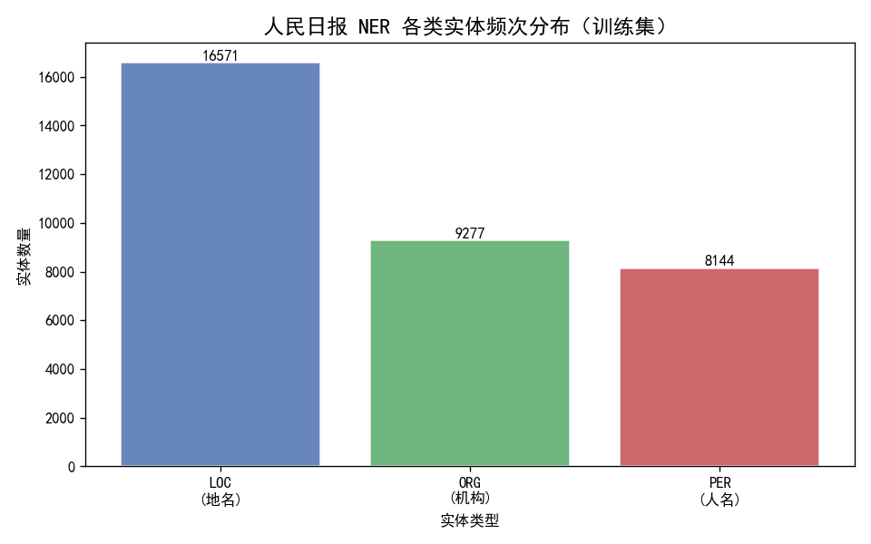
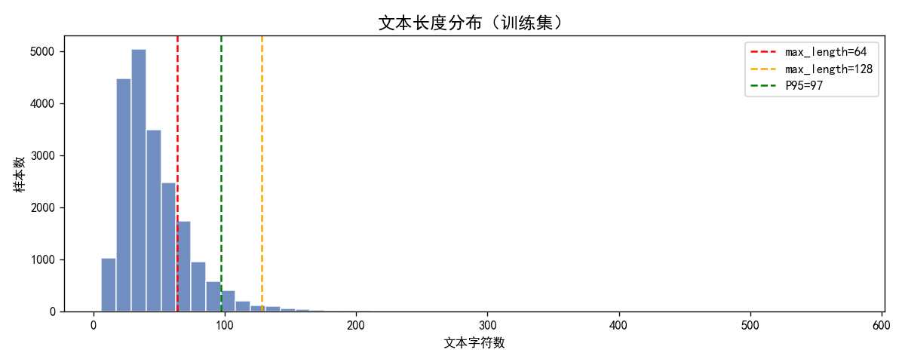
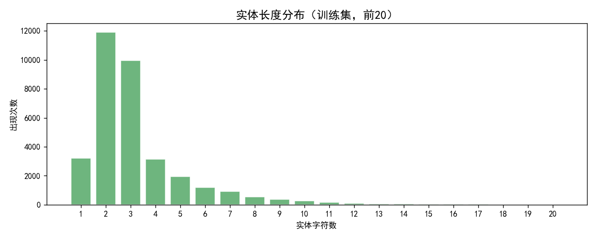

# Week7 序列标注问题 — 命名实体识别（NER）实验报告

## 一、实验概述

本实验以**人民日报 NER 数据集**为基础，系统对比了**序列标注**与**生成式**两大类 NER 方法的性能差异。实验涵盖以下方法：

| 方法 | 模型架构 | 核心思路 |
|------|---------|---------|
| BERT + Linear | BERT + 线性分类头 | 逐 token 独立预测 BIO 标签 |
| BERT + CRF | BERT + 条件随机场 | 全局最优序列解码，学习标签转移约束 |
| LLM API（Zero-shot） | DeepSeek-V4-Pro | 零样本提示，直接输出 JSON |
| LLM API（Few-shot） | DeepSeek-V4-Pro | 3 样本提示，引导格式对齐 |
| Qwen2.5-0.5B SFT（LoRA） | LoRA 微调 Qwen2.5-0.5B-Instruct | 监督微调，生成 JSON 实体列表 |
| Qwen2.5-0.5B SFT（全量） | 全量微调 Qwen2.5-0.5B-Instruct | 全参数微调，生成 JSON 实体列表 |

---

## 二、数据集

### 2.1 基本信息

| 数据集 | 样本数 |
|--------|--------|
| 训练集 | 20,864 |
| 验证集 | 2,318 |
| 测试集 | 4,636 |

数据集采用 **CoNLL BIO 标注格式**，每条样本包含 `tokens`（字符列表）和 `ner_tags`（BIO 标签列表）。

### 2.2 标签体系

共 **7 个 BIO 标签**，对应 **3 类实体**：

| 标签 | 说明 |
|------|------|
| O | 非实体 |
| B-PER / I-PER | 人名（如：周恩来、克林顿） |
| B-ORG / I-ORG | 机构名（如：国务院、北京大学） |
| B-LOC / I-LOC | 地名（如：北京、长江） |

### 2.3 数据分布



三类实体中，**LOC（地名）** 最多，**ORG（机构）** 次之，**PER（人名）** 最少，反映了人民日报新闻语料的地域信息密集特点。



文本长度主要集中在 20–80 字之间，P95 长度适中，`max_length=128` 可覆盖绝大部分样本。



实体长度以 **2–3 字** 居多（如"北京"、"周恩来"），少数机构名较长（如"长江轮船海外旅游总公司"）。

---

## 三、实验方法

### 3.1 BERT + Linear（线性分类头）

**模型结构**：

```
input_ids → BertModel → last_hidden_state (B, L, 768)
         → Dropout(0.1) → Linear(768, 7) → logits
```

- 每个 token 独立预测 BIO 标签，使用 `CrossEntropyLoss`（`ignore_index=-100` 跳过特殊 token 和非首子词）
- 预测方式：`argmax(logits, dim=-1)`
- **缺陷**：独立预测忽略标签间依赖关系，可能产生非法 BIO 序列（如 `B-PER` 后接 `I-ORG`）

### 3.2 BERT + CRF（条件随机场）

**模型结构**：

```
input_ids → BertModel → last_hidden_state (B, L, 768)
         → Dropout(0.1) → Linear(768, 7) → emissions
         → CRF 转移矩阵 → Viterbi 解码 → 最优标签序列
```

- 在 emissions 上叠加 **CRF 转移矩阵**，用 **Viterbi 算法** 找全局最优序列
- 损失函数：**负对数似然**（CRF 内部前向-后向算法计算）
- **优势**：自动学习转移约束（如 `O` 不能直接接 `I-X`，`B-PER` 后只能接 `I-PER` 或 `O` 或 `B-Y`），保证输出合法序列

### 3.3 训练策略（BERT 系列）

| 超参数 | 值 |
|--------|-----|
| 预训练模型 | bert-base-chinese |
| Epochs | 3 |
| Batch Size | 32 |
| Max Length | 128 |
| BERT 层学习率 | 2e-5 |
| 分类头学习率 | 1e-4（5× BERT 层） |
| 分层学习率 | ✓（BERT 层与分类头使用不同学习率） |
| 学习率调度 | Linear Warmup（warmup_ratio=0.1） |
| 梯度裁剪 | max_norm=1.0 |
| Dropout | 0.1 |

### 3.4 LLM API（Zero-shot / Few-shot）

使用 **DeepSeek-V4-Pro** API，设计了统一的 System Prompt：

```
你是一个命名实体识别（NER）专家，专门处理中文文本。
请从用户输入的文本中识别以下3类实体，并以 JSON 格式输出结果：
- PER：人名
- ORG：机构名称
- LOC：地名
输出格式：{"entities": [{"text": "实体文本", "type": "实体类型"}, ...]}
```

- **Zero-shot**：仅包含 System Prompt + 用户输入
- **Few-shot**：在 System Prompt 后添加 3 个标注示例，引导格式对齐
- 从验证集中**分层采样 100 条**，确保覆盖所有实体类型

### 3.5 LLM SFT（LoRA / 全量微调）

基于 **Qwen2.5-0.5B-Instruct**，将 BIO 格式数据转换为指令微调格式：

```
System: 你是一个命名实体识别助手...
User:   中共中央总书记习近平在北京主持会议
Assistant: {"entities": [{"text": "中共中央", "type": "ORG"}, ...]}
```

**Loss Mask 策略**：Prompt 部分标记为 `-100`，仅在 JSON 输出部分计算 loss。

| 超参数 | LoRA | 全量微调 |
|--------|------|---------|
| 学习率 | 2e-4 | 2e-5 |
| LoRA r / alpha | 8 / 16 | — |
| 目标模块 | q_proj, k_proj, v_proj, o_proj | — |
| 可训练参数比例 | ~0.22% | 100% |
| Batch Size | 4 | 4 |
| Gradient Accumulation | 4 | 4 |
| Max Length | 256 | 256 |
| Epochs | 3 | 3 |

---

## 四、实验结果

### 4.1 训练过程

#### BERT + Linear 训练日志

| Epoch | Train Loss | Val Loss | Val Entity F1 | 耗时 |
|-------|-----------|----------|---------------|------|
| 1 | 0.1554 | 0.0221 | 0.9259 | 113s |
| 2 | 0.0177 | 0.0166 | 0.9486 | 113s |
| 3 | 0.0084 | 0.0174 | **0.9504** | 113s |

#### BERT + CRF 训练日志

| Epoch | Train Loss | Val Loss | Val Entity F1 | 耗时 |
|-------|-----------|----------|---------------|------|
| 1 | 6.7084 | 1.0079 | 0.9275 | 180s |
| 2 | 0.8449 | 0.8141 | 0.9536 | 180s |
| 3 | 0.3862 | 0.9095 | **0.9567** | 182s |

> CRF 训练时间比 Linear 长约 **60%**（180s vs 113s/epoch），但 F1 提升约 **0.6%**。

#### Qwen2.5-0.5B SFT（LoRA）训练日志

| Epoch | Train Loss | Val Loss | 耗时 |
|-------|-----------|----------|------|
| 1 | 0.0589 | 0.0361 | 726s |
| 2 | 0.0242 | 0.0239 | 726s |
| 3 | 0.0154 | **0.0218** | 726s |

#### Qwen2.5-0.5B SFT（全量微调）训练日志

| Epoch | Train Loss | Val Loss | 耗时 |
|-------|-----------|----------|------|
| 1 | 0.0577 | **0.0331** | 995s |
| 2 | 0.0226 | 0.0367 | 995s |
| 3 | 0.0140 | 0.0397 | 997s |

> 全量微调第 2、3 个 epoch 出现**验证 loss 回升**（过拟合趋势），而 LoRA 的验证 loss 持续下降。

### 4.2 评估结果总览

#### 方法横向对比（验证集）

| 方法 | Precision | Recall | F1 | 非法序列数 | 备注 |
|------|-----------|--------|-----|-----------|------|
| **BERT + Linear** | 0.9463 | 0.9546 | **0.9504** | 61 (2.6%) | seqeval entity-level |
| **BERT + CRF** | 0.9538 | 0.9595 | **0.9567** | 39 (1.7%) | seqeval entity-level |
| **LLM Zero-shot** (DeepSeek-V4) | 0.8933 | 0.4833 | **0.6272** | — | span F1, 100 条采样 |
| **LLM Few-shot** (DeepSeek-V4) | 0.8903 | 0.6413 | **0.7456** | — | span F1, 100 条采样 |
| **Qwen2.5-0.5B LoRA SFT** | 0.9760 | 0.9385 | **0.9569** | — | span F1, 100 条采样 |

> **注意**：BERT 系列使用 seqeval（BIO 严格位置匹配），LLM/SFT 使用 span F1（text.find() 近似定位），两者评估标准不完全一致，但均可反映模型实际 NER 能力。

### 4.3 非法 BIO 序列分析

| 模型 | 非法开头 (I-X开头) | 非法转移 (B-X→I-Y) | 总非法 | 占比 |
|------|---------------------|---------------------|--------|------|
| BERT + Linear | 0 | 61 | 61 | 2.6% |
| BERT + CRF | 0 | 39 | 39 | 1.7% |

- CRF 将非法序列从 61 条降至 39 条，但未完全消除（理论上充分训练后可降至 0）
- 3 个 epoch 的训练下转移矩阵尚未完全收敛，更多 epoch 可进一步减少非法序列
- 线性头约 2.6% 的序列含非法转移，验证了独立预测的固有缺陷

### 4.4 LLM API 对比分析

| 指标 | Zero-shot | Few-shot (3例) |
|------|-----------|----------------|
| Precision | 0.8933 | 0.8903 |
| Recall | 0.4833 | **0.6413** |
| F1 | 0.6272 | **0.7456** |
| TP / Pred / Gold | 159/178/329 | 211/237/329 |

**关键发现**：
- Few-shot 的 **Recall 显著提升**（0.48 → 0.64），说明示例帮助模型理解了任务范围
- Precision 基本不变（~0.89），说明预测准确性稳定
- Zero-shot 的主要问题是**召回率不足**，大量实体被遗漏（尤其当句中实体密集时）
- LLM 在长句、多实体场景下表现较差（如"陈寅恪曾自称..."一句含 7 个人名，Zero-shot 全部遗漏）

### 4.5 SFT 小模型表现

Qwen2.5-0.5B LoRA SFT 达到了 **F1=0.9569**，与 BERT+CRF（0.9567）相当接近：
- **Precision 最高**（0.976）：SFT 后的模型非常"谨慎"，预测的实体基本都是正确的
- **Recall 略低**（0.938）：遗漏了一些边界模糊的实体（如"西施"作为人名被漏识别）
- **JSON 解析失败率为 0%**：模型完全学会了结构化 JSON 输出格式

---

## 五、讨论与分析

### 5.1 序列标注 vs 生成式 NER

| 维度 | 序列标注（BERT+CRF） | 生成式（LLM/SFT） |
|------|---------------------|-------------------|
| **F1 性能** | ⭐ 高（0.95+） | ⭐ 接近（SFT: 0.96）/ ❌ 低（API: 0.63~0.75） |
| **训练数据** | 需要大量 BIO 标注数据 | 需要标注数据（SFT）/ 无需训练数据（API） |
| **推理速度** | 快（单次前向传播） | 慢（自回归生成 JSON） |
| **输出可控性** | 严格 BIO 格式，无非法序列 | JSON 格式可能解析失败，无非法序列保证 |
| **扩展性** | 新增实体类型需重新训练 | 修改 Prompt 即可（API）/ 需重新训练（SFT） |
| **部署成本** | 低（110M 参数） | 低（LoRA 0.5B）/ 高（API 调用费） |

### 5.2 CRF 的价值

CRF 层在本实验中展现出两个关键优势：
1. **F1 提升**：从 0.9504 提升至 0.9567（+0.63%）
2. **非法序列减少**：从 61 条降至 39 条，转移约束有效地规范了标签序列

代价是训练时间增加约 60%（前向-后向算法 + Viterbi 解码的计算开销）。

### 5.3 LoRA vs 全量微调

- LoRA（可训练参数仅 ~0.22%）在 3 个 epoch 后验证 loss 仍在下降，**未出现过拟合**
- 全量微调从第 2 个 epoch 开始验证 loss 回升，出现**明显过拟合**
- 对于 0.5B 级别的小模型 + NER 任务，LoRA 是更优选择

### 5.4 误差分析

**BERT 系列的主要误差来源**：
- 边界不一致：如"中国、斯洛伐克联合登山队"被标注为一个 ORG，但模型可能将其拆分
- 嵌套实体：如"名古屋铁道会"vs"名古屋铁道"（ORG），扁平 BIO 标注无法处理嵌套

**LLM API 的主要误差来源**：
- 长句实体遗漏（Recall 低）
- 实体边界不一致（如"中东"vs"中东地区"）
- 格式偶尔不规范导致 JSON 解析失败

**SFT 模型的主要误差来源**：
- 罕见实体遗漏（如引用文本中的"继生"作为人名）
- 嵌套/复合实体边界判断偏差

---

## 六、结论

1. **BERT + CRF 是 NER 的可靠基线**：在人民日报数据集上达到 F1=0.9567，非法序列率仅 1.7%，适合工业部署。

2. **CRF 层对序列标注有实质帮助**：相比线性头，F1 提升 0.63%，非法序列减少 36%，代价是训练时间增加 60%。

3. **LLM API 在 Zero-shot 设定下 NER 性能有限**（F1=0.63），但 Few-shot 可显著提升（F1=0.75），说明大模型具备 NER 能力但需要适当的 Prompt 引导。

4. **小模型 SFT 可媲美 BERT+CRF**：Qwen2.5-0.5B 经过 LoRA 微调后 F1=0.9569，与 BERT+CRF 基本持平，展示了生成式 NER 在有标注数据场景下的可行性。

5. **LoRA 微调是高效选择**：仅训练 0.22% 的参数即可达到与全量微调相当的效果，且不易过拟合。

---

## 七、项目文件结构

```
作业/
├── data/peoples_daily/          # 人民日报 NER 数据集
│   ├── train.json               # 训练集 (20,864 条)
│   ├── validation.json          # 验证集 (2,318 条)
│   ├── test.json                # 测试集 (4,636 条)
│   └── label_names.json         # 标签列表
├── src/                         # BERT 序列标注代码
│   ├── dataset.py               # 数据集类 + BIO 子词对齐
│   ├── model.py                 # BertNER / BertCRFNER 模型
│   ├── train.py                 # 训练脚本
│   ├── evaluate.py              # 评估脚本 (seqeval + 非法序列统计)
│   └── explore_data.py          # 数据探索与可视化
├── src_llm/                     # LLM / SFT 代码
│   ├── llm_ner.py               # LLM API zero-shot/few-shot NER
│   ├── train_sft.py             # SFT 训练 (LoRA / 全量微调)
│   └── evaluate_sft.py          # SFT 评估 (span F1)
└── outputs/
    ├── checkpoints/             # 模型权重
    │   ├── best_linear.pt
    │   └── best_crf.pt
    ├── figures/                 # 数据可视化图表
    ├── logs/                    # 训练/评估日志 (JSON)
    ├── sft_adapter/             # LoRA adapter 权重
    └── sft_full_ckpt/           # 全量微调权重
```
